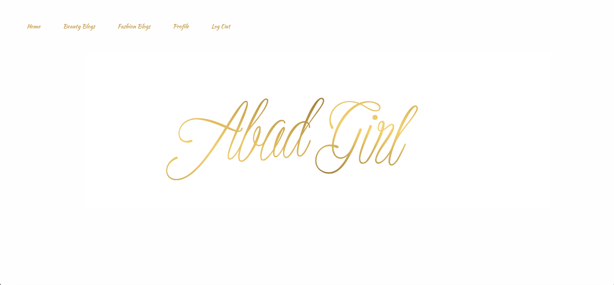
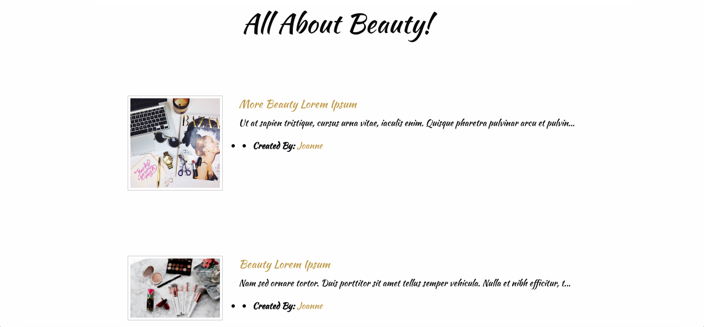
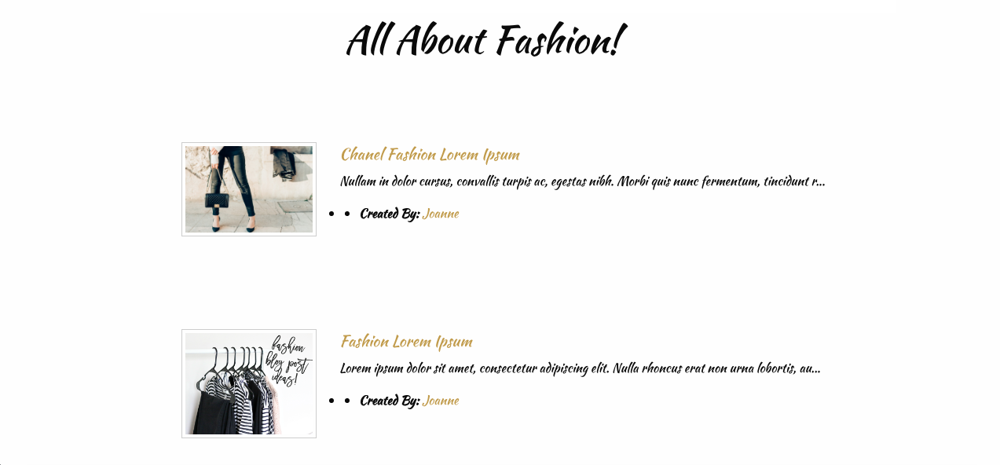

##PROJECT 3
* AbadGirl.com
* A Beauty and Fashion Blogging platform where user's can create blog post about what they are passionate about.  User's are able to add a URL photo to their beauty or fashion blog post and can share for other user's to see.

##TECHNOLOGIES USED:
* Ruby on rails
* Foundation
* jQuery
* Heroku

##WORKFLOW TOOLS:
* Trello: https://trello.com/b/oE6koIUz/project-3

##PLANNED FEATURES:
* A user can create an account with first&last name, email, and password.
* A user can update or delete their profile.
* A user is able to log-in and log-out of their account.
* A user is able to create, read, update, and delete a blog post.
* A user can add a photo URL to blog post.
* A user is able to see blog photos of beauty and fashion content.
* A user is able to click on Beauty button and be directed to Beauty blog page.
* A user is able to click on Fashion button and be directed to Fashion blog page.

##FUTURE FEATURES:
* A user is able to click on About button and see bloggers about page.
* A user can update their about me page.
* A user is able to upload a photo to their blog post.
* A user is able to delete a photo of their blog post.
* A user can add a URL to items they feature on their blog.
* A user is able to click item links on beauty or fashion page and be brought to those sites.
* A user is able to click Facebook, Instagram, and Twitter icons and be brought to those sites.
* Cloudinary to upload photos.
